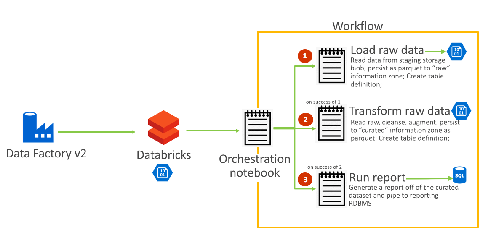

# 1. About the workshop

### ADFv2 and Databricks integration
Out of the box, an Azure Data Factory v2 pipeline can automate orchestration of Spark applications in Databricks notebooks, with a "notebook activity", including spawning a new cluster, or leveraging an existing live cluster.  It supports passing input parameters to the notebook activity with "base parameters" (ADFv2) and "widgets" (Databricks). 

Dependencies are covered as part of the workshop. 

### Workshop scope
We will build a simple workflow with 3 Databricks Notebook activities in a sequential fashion, with dependency on prior notebook's successful run, and trigger it with Azure Data Factory v2. 

**1. Dataset:** NYC Taxi dataset 
**2. Data engineering pipeline components (Scala notebooks):** Activites that load (notebook 1), transform (notebook 2), run a report (notebook 3) and pipe to an Azure SQL database table in batch. 
**3. Orchestration of notebook execution:** Databricks notebook with %run to call the component notebooks 
**4. Scheduled/On-demand automation of orchestration of notebook execution:** Azure Data Factory v2  

  

 

**Discussion:**  
- Why not just use the orchestration and scheduler in Databricks? 
- Why not use Azure Data Factory for orchestration of notebook execution? 
- Why use Azure Data Factory v2? 
- Other options with Azure Data Factory v2 for orchestration of multiple activites? 

# 2. Setup

### 2.0.1. Provision an Azure resource group in US East 2
Call it adfv2ws-rg

### 2.0.2. Provision a general purpose v2 Azure storage account in the resource group from 2.0.1
Give it a prefix of adfv2ws followed by any suffix for uniqueness

### 2.0.3. Create containers in your Azure blob storage account 
Create one container called (1) raw, one called (2) curated - with access level of private (no anonymous access)

### 2.0.4. Make a note of the storage account name and key 
Note this down - we will use this for mounting the storage account

### 2.0.5. Provision an Azure Data Factory v2
- Create it in East US 2 - same region, same resource group

### 2.0.6. Provision an Azure SQL Database
- Create a database in the East US 2 region - same region, same resource group
- SKU - select Standard S1: 20 DTUs

### 2.0.7. Provision an Azure Databricks workspace
- Select "Premium" in the pricing tier
- Give it a prefix of adfv2ws followed by any suffix for uniqueness 
- Ensure you pick the right resource group and region - East US 2  
Leave all other options as defaults

### 2.0.8. Provision a Databricks cluster in your workspace
Select:
- cluster mode - standard
- databricks runtime - 5.1
- enable auto-scaling - uncheck
- terminate after - 30 minutes of inactivity
- worker type - ds3v2
- worker count - 3  
Leave all other entries with default values and click create.

### 2.0.9. Download the Databricks DBC
The DBC is at -  
https://github.com/anagha-microsoft/databricks-workshops/blob/master/adfv2-workshop/dbc/adfv2-workshop.dbc

### 2.0.10. Import the DBC into your Databricks workspace
Follow the instructor and persist to your user home directory in the Databricks workspace

### 2.0.11. Mount blob storage
Run the notebook in 00-Setup/mount-blob-storage.scala

### 2.0.12. Get the credentials for the source storage account from instructor

Note: Although the notebooks reference secrets, it is out of scope for the workshop due to time constaint. 

# 3. About the NYC taxi public dataset 

This dataset contains detailed trip-level data on New York City Taxi trips. It was collected from both drivers inputs as well as the GPS coordinates of individual cabs. 

**The data is in a CSV format and has the following fields:**
* tripID: a unique identifier for each trip
* VendorID: a code indicating the provider associated with the trip record
* tpep_pickup_datetime: date and time when the meter was engaged
* tpep_dropoff_datetime: date and time when the meter was disengaged
* passenger_count: the number of passengers in the vehicle (driver entered value)
* trip_distance: The elapsed trip distance in miles reported by the taximeter
* RatecodeID: The final rate code in effect at the end of the trip -1= Standard rate -2=JFK -3=Newark -4=Nassau or Westchester -5=Negotiated fare -6=Group ride
* store_and_fwd_flag: This flag indicates whether the trip record was held in vehicle memory before sending to the vendor because the vehicle did not have a connection to the server - Y=store and forward; N=not a store and forward trip
* PULocationID: TLC Taxi Zone in which the taximeter was engaged
* DOLocationID: TLC Taxi Zone in which the taximeter was disengaged
* payment_type: A numeric code signifying how the passenger paid for the trip. 1= Credit card 2= Cash 3= No charge 4= Dispute 5= Unknown 6= Voided trip
* fare_amount: The time-and-distance fare calculated by the meter.
* extra: Miscellaneous extras and surcharges
* mta_tax: $0.50 MTA tax that is automatically triggered based on the metered rate in use
* tip_amount: Tip amount –This field is automatically populated for credit card tips. Cash tips are not included
* tolls_amount:Total amount of all tolls paid in trip
* improvement_surcharge: $0.30 improvement surcharge assessed trips at the flag drop.
* total_amount: The total amount charged to passengers. Does not include cash tips.

# 4. Databricks notebooks - review
From the cluster, lets open up the notebooks, in the order below and review and run as needed.

### 1.  Mount blob Storage (00-setup/mount-blob-storage.scala)
In this notebook, we will mount the two blob storage account containers created in the setup rocess
This is a one-time setup and is not in scope for automation.

### 2.  Load data (01-ELT/01-load.scala)
In this notebook, we will read raw NYC taxi data (CSV) sitting in a staging storage account and persist to our "raw" information zone (mounted) as Parquet.  Before persisting, we will ensure that all the datatypes are exactly as required.  Th dataset is vry small and is therefore not partitioned (physically) based on access needs.  We will create a Hive table on this dataset.

### 3.  Curate data (01-ELT/02-curate.scala)
In this notebook, we will read the raw Parquet NYC taxi data in the raw information zone and we will transform the same - do some cleansing and some augmenting with temporal attributes and persist to the curated information zone as Parquet.  We will create a Hive table on this dataset.

### 4.  Reporting (02-Reporting/02-curate.scala)
In this notebook, we will create a report and pipe the report into the RDBMS we created.

### 5.  Workflow (03-Orchestrate/workflow.scala)
In this notebook - we will run a series of notebooks sequentially if the prior notebook executes successfully.

# 5. ADFv2 scheduling/orchestration 
We will create an ADFv2 pipeline with a notebook activity in this final section. 
### 1.  Create a Databricks token for use in ADFv2 
In the UI - go to workspace->settings->access tokens and create a token.  Capture and note down safely.  
### 2.  Create a linked service for Databricks compute from the Data Factory UI 
- This has a dependency on (1) Databricks workspace - should exist already, and (2) also the Databricks token 
- Select your subscription 
- Enter your access token 
- Select DBR 5.1 
- Select DS3v2 - 3 workers, fixed  
### 3.  Create a pipeline 
- Add a Databricks notebook activity 
- In the notebook activity, in the general tab, name the workflow 
- In the Azure Databricks tab, select the linked service and test connection 
- In the settings path, navigate and pick the notebook - adfv2-workshop/03-Orchestrate/workflow.scala 
- Validate the pipeline 
- Debug the pipeline 
- Publish the pipeline  
### 4.  Trigger the pipeline 
- Run the pipeline now 
Refer documentation to familiarize yourself with scheduling a pipeline  
### 5.  Monitor the pipeline  
### 6.  Lets review the execution of the workflow in Databricks  

### 7.  Discussion:
Passing parameters to your cluster (base parameters in notebook activity settings) and between notebooks (notebook widgets)

# Help us improve this
This is a community contribution, and can be improved.  We appreciate your support and feedback.

# Source dataset:
Is here - https://nyctaxiadfv2sa.blob.core.windows.net/taxidata/NYC_Cab.csv
