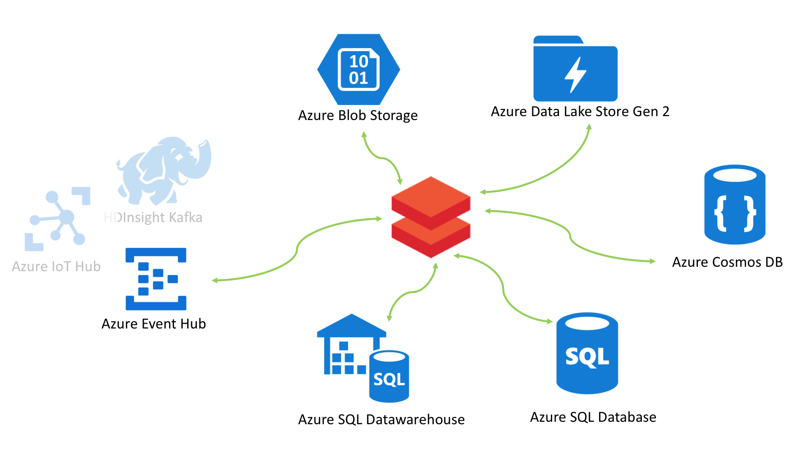

# Databricks workshop

This is a multi-part (free) workshop featuring Azure Databricks. It covers basics of working with Azure Data Services from Spark on Databricks with Chicago crimes public dataset, followed by an end-to-end data engineering workshop with the NYC Taxi public dataset, and finally an end-to-end machine learning workshop.  The workshop is offered in Scala and Python. 

The goal of this workshop is deliver a clear understanding of how to provision Azure data services, how the data services services integrate with Spark on Azure Databricks, to give you end to end experience with basic data engineering and basic data science on Azure Databricks, and to share some boilerplate code to use in your projects.   

This is a community contribution, so we appreciate feedback and contribution. 

## Target audience:
Architects and Data engineers 

##  Pre-requisite knowledge:
Prior knowledge of Spark, is beneficial, as is familiarity/experience with Scala/Python wuthout or without Spark in context.

## Azure pre-requisites:
A subscription with at least $200 credit for a continuous 10-14 hours of usage. 

## 1.  Module 01-Primer:
This module covers basics of integrating with Azure Data Services from Spark on Azure Databricks in batch mode and with structured streaming. 

At the end of this module, you will know how to provision, configure, and integrate from Spark with- 
1.  Azure storage - blob storage, ADLS gen1 and ADLS gen2; Includes Databricks Delta as well 
2.  Azure Event Hub - publish and subscribe in batch and with structured streaming; Includes Databricks Delta 
3.  HDInsight Kafka - publish and subscribe in batch and with structured streaming; Includes Databricks Delta 
4.  Azure SQL database - read/write primer in batch and structured streaming 
5.  Azure SQL datawarehouse - read/write primer in batch and structured streaming 
6.  Azure Cosmos DB (core API - SQL API/document oriented) - read/write primer in batch and structured streaming; Includes structured streaming aggregation computation 
7.  Azure Data Factory - automating Spark notebooks in Azure Databricks with Azure Data Factory version 2 
8.  Azure Key Vault for secrets management 

The Chicago crimes dataset is leveraged in the lab. 

## 2.  Module 02-Data engineering workshop:
This is a *batch focused* module and covers building blocks of standing up a data engineering pipeline.  The [NYC taxi dataset](http://www.nyc.gov/html/tlc/html/about/trip_record_data.shtml) (yellow and green taxi trips) is leveraged in the labs.
 

 
 

The following is a summary of content covered:
1.  Organizing data in the file system  - architectural considerations, best practices, directory layout, mount storage etc 
2.  Load transaction data, reference data - persist to Parquet format, create external tables for the **RAW** zone 
3.  Transform data - cleanse, de-duplicate, apply business logic and derive/transform and persist to Parquet; Map disparate schemas to a canonical data model; Create external tables in the **CURATED** zone 
4.  Create denormalized, materialized views (tables) in Delta/Parquet and persist to **CONSUMPTION** zone of storage; The layer will give the best performance from a storage and query perspective.  Create external tables on the datasets 
5.  Generate canned reports & visualization, and persist to Parquet to the **DISTRIBUTION** zone of storage 
6.  Integrate reports generated to a reporting datamart RDBMS 
7.  Create a batch job to automate report generation in Spark and and integration with reporting datamart for BI 

Performance optimization is not in scope and will be offered as a separate workshop.

## Next
[Provisioning guide](docs/1-provisioning-guide/ProvisioningGuide.md) 
[Lab data copy guide](docs/3-data-copy-guide/README.md) 
[Lab guide](docs/2-lab-guide/README.md)

## Credits
Anagha Khanolkar (Chicago) - creator of workshop, primary author of workshop, content design, all development in Scala, primer module in Pyspark 
Ryan Murphy (St Louis) - contribution to the data engineering workshop transformation rules, schema and more 
Rajdeep Biswas (Houston) - writing the entire PySpark version of the data engineering lab Anagha deveoped in Scala 
Steve Howard (St Louis) - contributing to the PySpark version of the data engineering lab 
Erik Zwiefel (Minneapolis) - content design of data science lab, PySpark version, Azure Machine Learning service integration for operationalization as a REST service, AutoML 
Thomas Abraham (St Louis) - development of ADFv2 integration primer in Pyspark 
Matt Stenzel, Christopher House (Minneapolis) - testing

