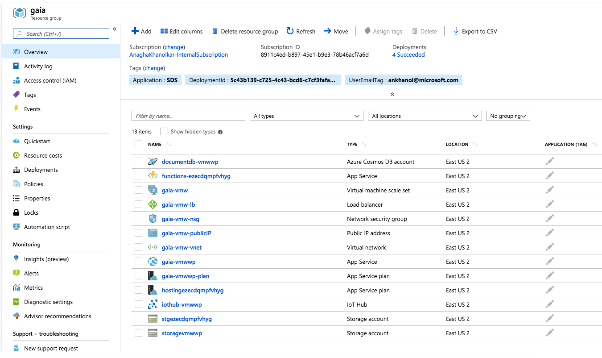

# Provisioning Guide

For the workshop, we will need to provision multiple resources/services.  Many of these are for the primer only as labeled below.  The following is a step-by-step provisioning guide. 
1.   Azure Resource group 
2.   Azure Virtual network 
3.   Azure Databricks 
4.   Azure Blob Storage (for the primer only) 
5.   Azure Data Lake Storage Gen2 
6.   Azure Event Hub (for the primer only) 
7.   Azure HDInsight Kafka (for the primer only) 
8.   Azure SQL Database 
9.   Azure SQL Datawarehouse (for the primer only) 
10.   Azure Cosmos DB (for the primer only) 
11.   Azure Data Factory v2 (for the primer only)  
12.   Azure Key Vault (for the primer only) 
13.   Azure IoT hub and device telemetry simulator (for the primer only)  

**Note**: All resources shoud be **provisioned in the same datacenter**. 

## 1. Provision a resource group
Create a resource group called "gws-rg" into which we will provision all other Azure resources. 
https://docs.microsoft.com/en-us/azure/azure-resource-manager/resource-group-portal

## 2.  Provision a virtual network (Vnet)
Provision an Azure Vnet in #1.  
https://docs.microsoft.com/en-us/azure/virtual-network/quick-create-portal#create-a-virtual-network

## 3.  Provision Azure Databricks
Provision an Azure Databricks workspace in the Vnet we created in #2, the same resource group as in #1, and in the same region as #1.  Then peer the Dataricks service provisioned Vnet with the Vnet from #2 for access.  We will discuss Vnet injection in the classroom. 
[Provision a workspace & cluster](https://docs.microsoft.com/en-us/azure/azure-databricks/quickstart-create-databricks-workspace-portal#create-an-azure-databricks-workspace)
[Peering networks](https://docs.azuredatabricks.net/administration-guide/cloud-configurations/azure/vnet-peering.html)

## 4.  Provision a blob storage account
Provision an Azure Blob Storage account (gen1) in #1 
https://docs.microsoft.com/en-us/azure/storage/common/storage-quickstart-create-account?toc=%2fazure%2fstorage%2fblobs%2ftoc.json

## 5.  Provision Azure Data Lake Store Gen2
Provision an Azure Lake Store Gen 2 account in #1 - with Hierarchical Name Space (HNS) enabled.   
https://docs.microsoft.com/en-us/azure/storage/data-lake-storage/quickstart-create-account

## 6.  Provision Azure Event Hub
Provision Azure Event Hub in #1, and a consumer group.  Set up SAS poliies for access, and capture the credentials required for access from Spark. 
https://docs.microsoft.com/en-us/azure/event-hubs/event-hubs-create

## 7.  Provision Azure HDInsight Kafka
Provision a Kafka cluster in the resource group and Vnet from #2.  Enable Kafka to advertise private IPs, and configure it to listen on all network interfaces.  
Provisioning: https://docs.microsoft.com/en-us/azure/hdinsight/kafka/apache-kafka-get-started#create-an-apache-kafka-cluster 
Broadcast IP addresses, configure listener: https://docs.microsoft.com/en-us/azure/hdinsight/kafka/apache-kafka-connect-vpn-gateway#configure-kafka-for-ip-advertising

## 8.  Provision Azure SQL Database
Provision a logical database server in #1, and an Azure SQL Database within the server.  Configure the firewall to allow our machine to access, and also enable access to the Dataricks Vnet.  Capture credentials for access from Databricks. 
https://docs.microsoft.com/en-us/azure/sql-database/sql-database-get-started-portal#create-a-sql-database 
We will work on the firewall aspect in the classroom.

## 9.  Provision Azure SQL Datawarehouse
Provision an Azure SQL datawarehouse in #1 in the same database server created in #8. 
https://docs.microsoft.com/en-us/azure/sql-data-warehouse/create-data-warehouse-portal#create-a-data-warehouse

## 10.  Provision Azure Cosmos DB
Provision a Cosmos DB account in #1, a database and 3 collections - one for batch load, one for stream ingest and one for streaming computations. 
Complete step 1, 2 and 3 from the link - https://docs.microsoft.com/en-us/azure/cosmos-db/sql-api-get-started

## 11.  Provision Azure IoT hub device simulator (this will provision Azure IoT hub automatically)
The instructions are [here](https://github.com/anagha-microsoft/databricks-workshops/blob/master/iot/docs/Provisioning-1-AzureIoT.md).  The accelerator provisions a new resource group.  Ensure you select the same Azure region. 
You will see a new resource group created and a number of resources- 

 

## 12.  Provision Azure Data Factory v2
Provision Azure Data Factory v2 instance in #1. 
Complete steps 1-9 from the link - https://docs.microsoft.com/en-us/azure/data-factory/quickstart-create-data-factory-portal#create-a-data-factory

