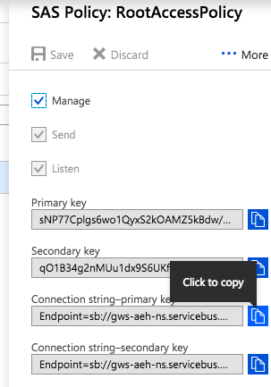

# 01. Azure Event Hub - Lab instructions

In this lab module - we will learn to publish/consume events from Azure Event Hub with Spark Structured Streaming.  The source is the curated crimes dataset in DBFS, and the sink is DBFS in Delta format. 

~/Desktop/2-aeh/15.png  .

### 1.1. Provision Event Hub

 

 

 

 

 

 

### 1.2. Create consumer group within event hub

 

 

 

 

### 1.3. Create SAS policy for accessing from Spark

 

 

 

 

 

 

 

 

 

 

### 1.4. Attach Spark connector library hosted in Maven
This step is performaned on the Databricks cluster.
 
The maven coordinates are- 
com.microsoft.azure:azure-eventhubs-spark_2.11:2.3.6 
Be sure to get the latest from here- https://docs.databricks.com/spark/latest/structured-streaming/streaming-event-hubs.html#requirements 

 

 

 

 

 

 

