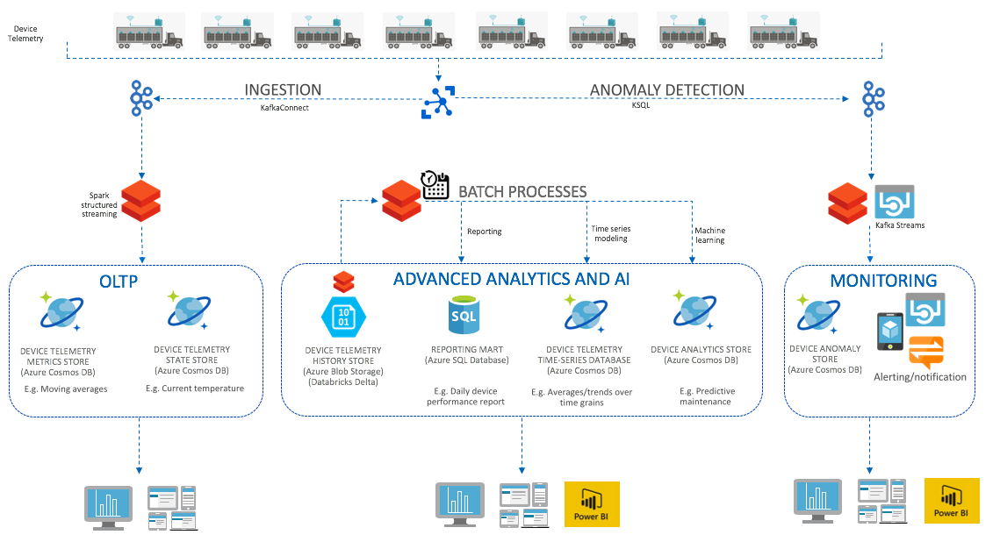
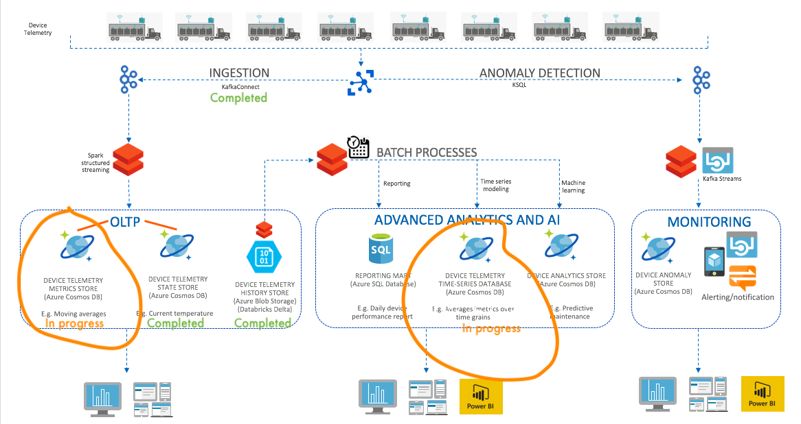

## 1.0. About
This is a workshop showcasing most aspects of an end to end Azure IoT solution as referenced [below](decks/ReferenceArchitecture.pptx). 

It covers:  
1.  simulated device telemetry publishing to Azure IoT hub, 
2.  device telemetry from #1, sourced to Kafka on HDInsight through KafkaConnect  
3.  telemetry ingestion via Spark structured streaming on Azure Databricks 
4.  telemetry persistence into Azure Cosmos DB 
5.  reports generated in Azure Databricks, persisted to an RDBMS 
6.  live device stats dashboard 
  
The workshop solution leverages multiple Azure PaaS services -  
  - Azure IoT Hub (Scalable IoT PaaS)  
  - Azure HDInsight Kafka (Scalable streaming pub-sub) - Hortonworks Kafka PaaS  
  - Azure Cosmos DB (NoSQL PaaS)  - for device registry and streaming device telemetry persistent store  
  - Azure Databricks (Spark PaaS) - for distributed processing  
  - Azure SQL Database (SQL Server PaaS) - for reporting serve layer  
  - Power BI (BI SaaS)  
  
## 2.0. Workshop
### 2.0.1. Modules 
[Module 1: Provision services, configure and start services](docs/WorkshopReadMe.md#module-1-provision-services-configure-and-start-services) 
[Module 2: One time setup in Databricks - mount blob storage](docs/WorkshopReadMe.md#module-2-setup) 
[Module 3: Structured Stream Processing - device current state capture into Azure Cosmos DB (nosql/OLTP store)](https://github.com/anagha-microsoft/databricks-workshops/blob/master/iot/docs/WorkshopReadMe.md#module-3-structured-stream-processing---device-current-state-capture-into-azure-cosmos-db-nosql) 
[Module 4: Structured Stream Processing - device telemetry history capture into Databricks Delta (analytics store)](docs/WorkshopReadMe.md#module-4-structured-stream-processing---device-telemetry-history-capture-into-databricks-delta) 
Module 5: Stateful Structured Stream Processing - moving averges capture into Azure Cosmos DB (nosql/OLTP store) 
Module 6: Batch Processing - reports persisted to Azure SQL Database (reporting mart) 
Module 7: Batch Processing - time series modeling and persisting to Azure SQL Database and Databricks Delta 
Module 8: BI and visualization - sourced from SQL Database, and over Spark against blob storage 
Module 9: Real time dashboard 
Module 10: Anomaly detection and alerting 
Module 11: Adanced analytics- AI in IoT 

