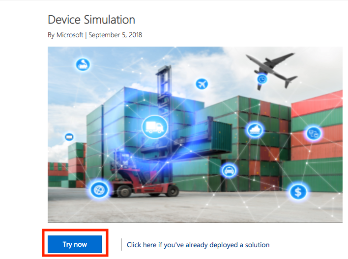
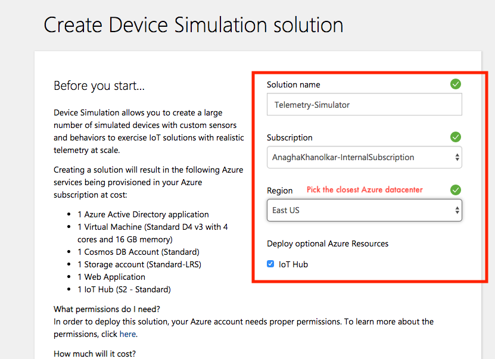
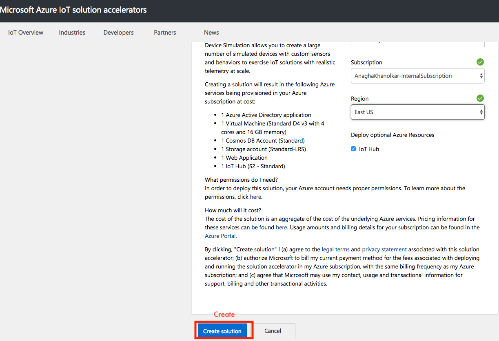
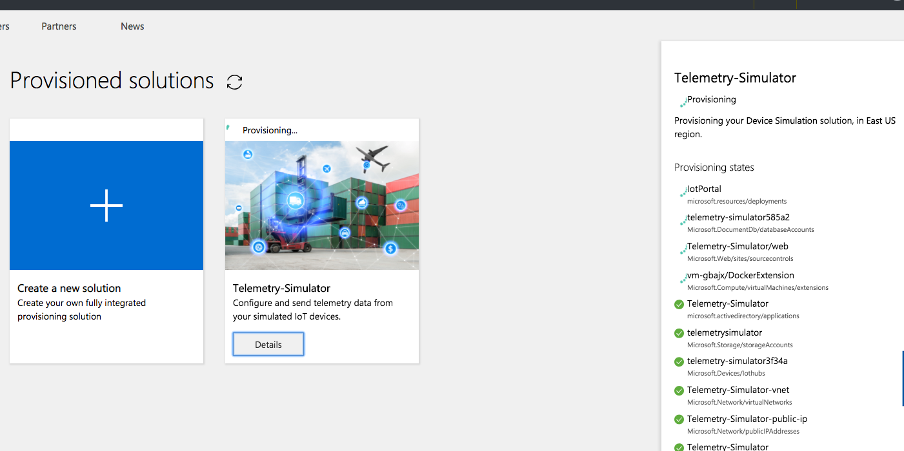
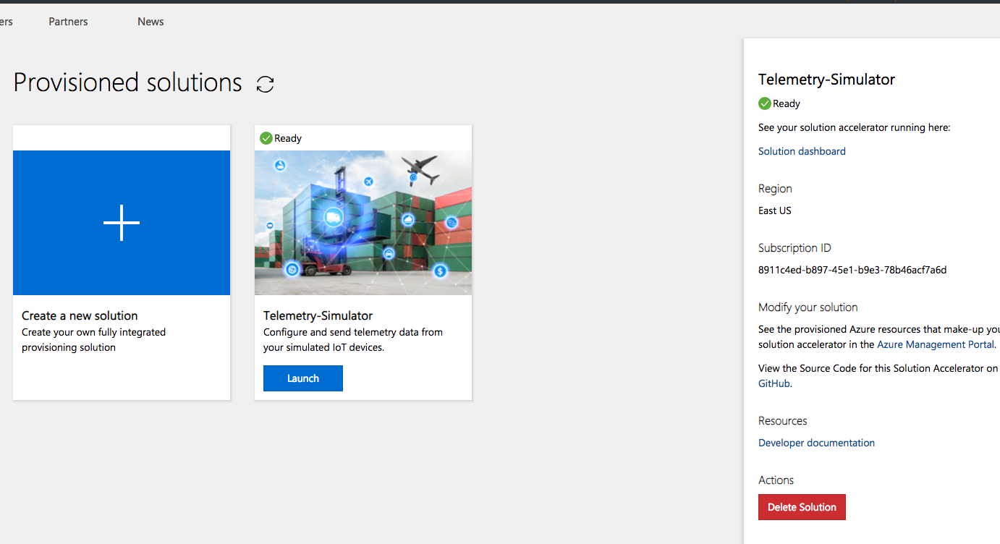
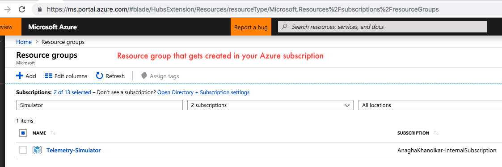
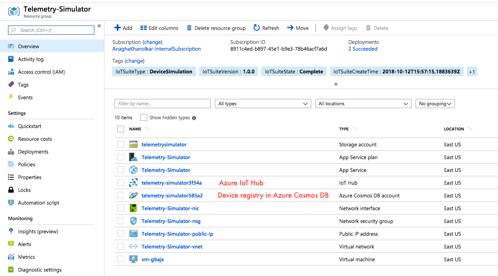

This section covers provisioning and all necessary configuration required for Azure IoT and the device telemetry simulator.

# 1. Azure IoT Hub
We will launch an Azure IoT solution accelerator for device simulation.  With a few clicks, this will provision an Azure IoT hub and provide a web page to select number of simulated devices, type of telemetry (e.g. chiller), and simulate telemetry at periodic intervals for a specific period of time or indefinitely.

### 1.0.1. Provision the device telemetry generator 
1.  Go to https://www.azureiotsolutions.com/Accelerators and select the "Device Simulation" accelerator.<br>


<br>2.  Deploy<br>

3.  Name it "Telemetry-Simulator", select your Azure subscription and pick the closest Azure datacenter.<br>
The datacenter you selected will need to be used across the board for the rest of the solution.  make a note of the same.

<br>
4.  Create the simulator<br>

<br>
5.  You should see an entry like this<br>

<br>
6.  Give it about ten minutes, you should see this.<br>
Note the option to delete when you are done with this workshop.

<br>
7.  This resource group gets created in your subscription<br>

<br>
8.  With these resources in it<br>

<br>

### 1.0.2. Create consumer groups
1.  From the Azure portal, navigate to the IoT hub instance provisioned in 3.0.1.<BR>
2.  Select Endpoints<BR>
3.  From "Built-in endpoints", select "Events"<BR>
4.  Create one consumer group called "kafkaConnect-cg"<BR>
5.  Create one consumer group called "spark-cg"<BR>

### 1.0.3. Capture key information needed for KafkaConnect and Spark integration
Capture the following:<br>
1. Event Hub-compatible name; e.g. ```bhoomi-telemetry-simulator```
2. Event Hub-compatible endpoint (starts with ```sb://```, ends with ```.servicebus.windows.net/```; e.g. ```sb://iothub-ns-bhoomi-tel-8....servicebus.windows.net/```
3. Partitions; E.g. ```4```
4. Shared access key<br>
On the portal, inside your IoT hub service, go to the left navigation panel and select "Shared Access Policies".  Then click on the policy "service", and capture the primary key

### 1.0.4. Launch the simulator
Launch the simulator from 3.0.1, against the provisioned Azure IoT instance, to run every 10 seconds with 200 devices, to run for an hour.
