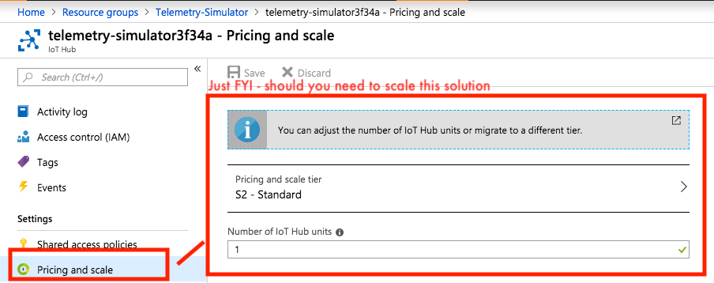
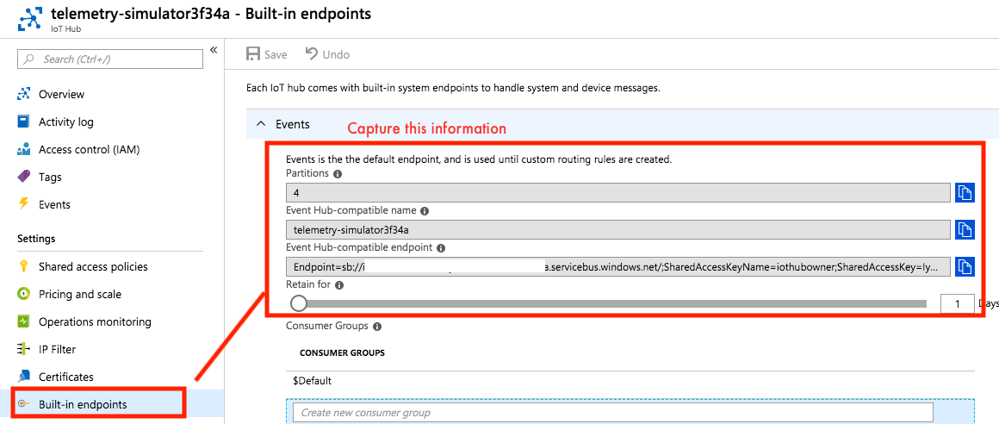
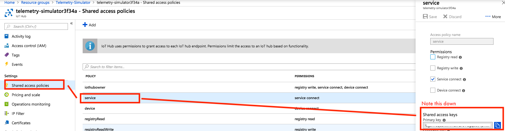
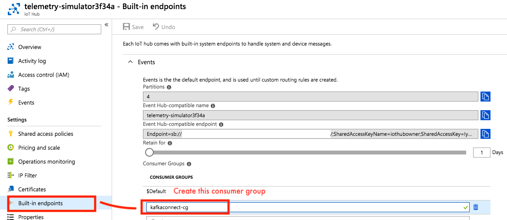
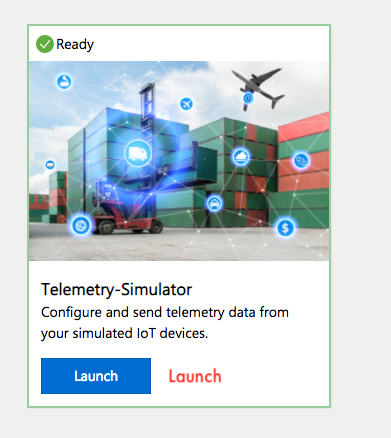
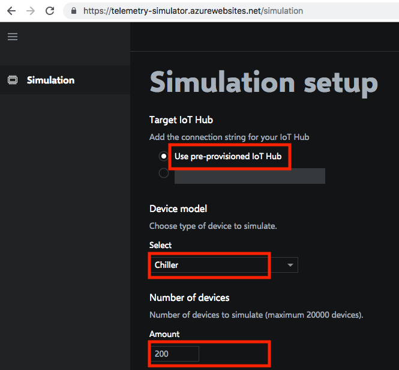
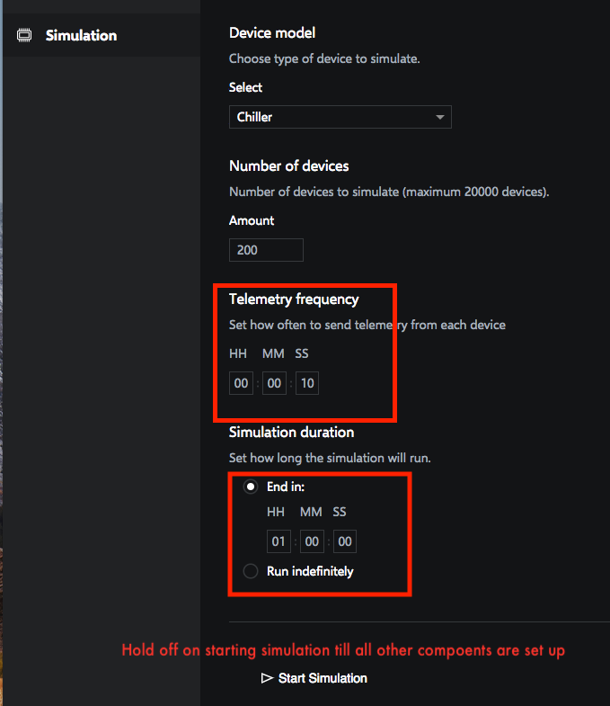

This section covers provisioning and all necessary configuration required for Azure IoT and the device telemetry simulator.

# 1. Azure IoT Hub
We will launch an Azure IoT solution accelerator for device simulation.  With a few clicks, this will provision an Azure IoT hub and provide a web page to select number of simulated devices, type of telemetry (e.g. chiller), and simulate telemetry at periodic intervals for a specific period of time or indefinitely.

## 1.0.1. Provision the device telemetry generator 
1.  Go to https://www.azureiotsolutions.com/Accelerators and select the "Device Simulation" accelerator.<br>


<br>2.  Deploy<br>


<br>3.  Name it "Telemetry-Simulator", select your Azure subscription and pick the closest Azure datacenter.<br>
The datacenter you selected will need to be used across the board for the rest of the solution.  make a note of the same.


<br>4.  Create the simulator<br>


<br>5.  You should see an entry like this<br>


<br>6.  Give it about ten minutes, you should see this.<br>
Note the option to delete when you are done with this workshop.


<br>7.  This resource group gets created in your subscription<br>


<br>8.  With these resources in it<br>

<br>

## 1.0.2. Configure Azure IoT Hub, capture key information
### 1.0.2.1. From the Azure portal, navigate to the IoT hub instance provisioned in 1.0.1.<BR>

  
### 1.0.2.2. Familiarize yourself with scaling settings


### 1.0.2.3. Capture the Event Hub endpoint details
1a. Event Hub-compatible name<br>
1b. Event Hub-compatible endpoint (starts with ```sb://```, ends with ```.servicebus.windows.net/```<br>
1c. Partitions<br>



### 1.0.2.4. Capture the IoT hub shared access key
On the portal, inside your IoT hub service, go to the left navigation panel and select "Shared Access Policies".  Then click on the policy "service", and capture the primary key


### 1.0.2.5. Create a consumer group for KafkaConnect in your Azure IoT Hub
Select "Built-in endpoints", select "Events" and create one consumer group called "kafkaconnect-cg".

  

## 1.0.3. Launch the simulator
Launch the simulator from 1.0.1, against the provisioned Azure IoT instance, to run every 10 seconds with 200 devices, to run for an hour as shown below, but do not start the simulation, till all provisioning and set up is complete.<br><br>






