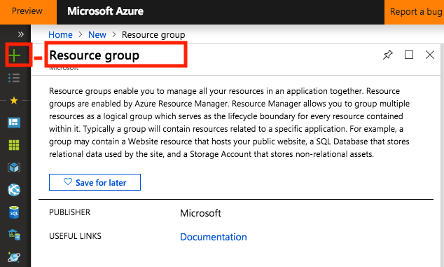
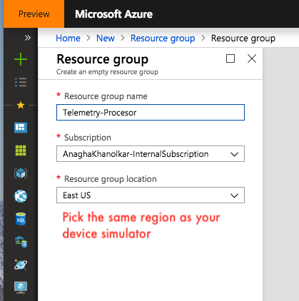
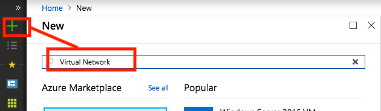
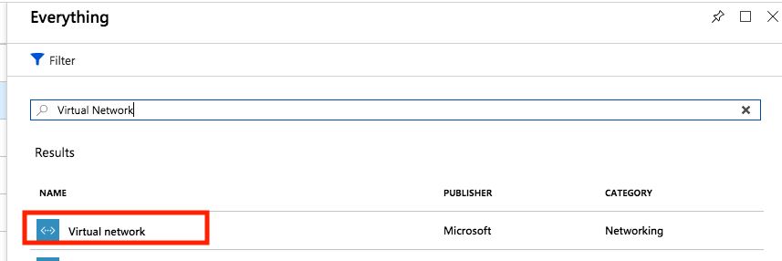
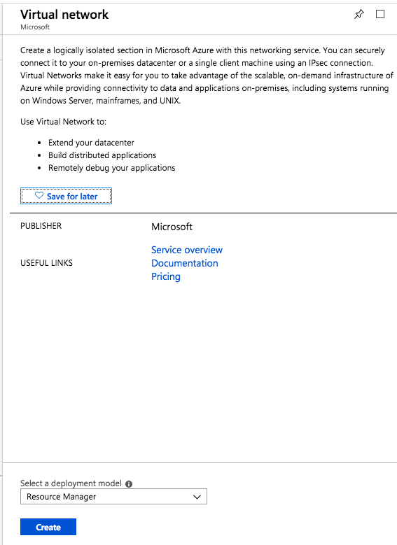
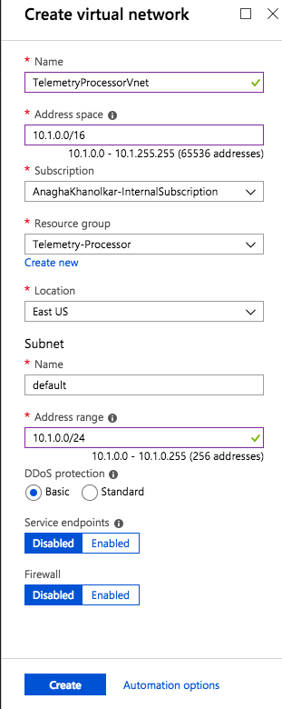
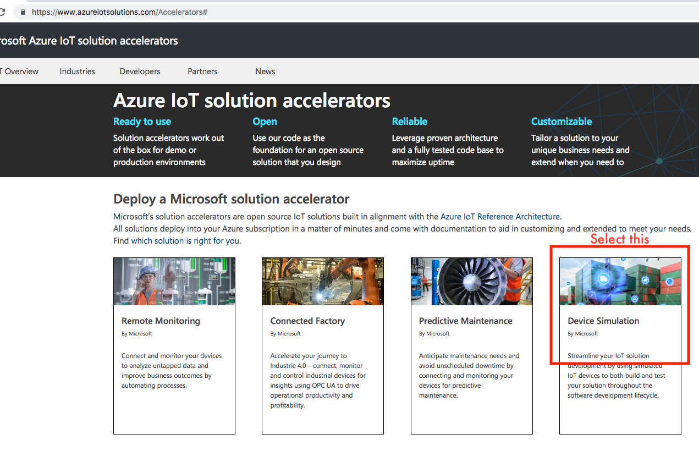

This section covers provisioning of resource group and VNet for the IoT telemetry processing services.

# 2. Azure Resource Group
From the portal create a resource group called Telemetry-Processor in the same Azure region/datacenter you provisioned the device telemetry simulation. 

 

# 3. Azure Virtual Network
From the portal, from within your resource group from #2, create a virtual network.

  

  

  

## 1.0.1. Provision the device telemetry generator 
1.  Go to https://www.azureiotsolutions.com/Accelerators and select the "Device Simulation" accelerator. 

