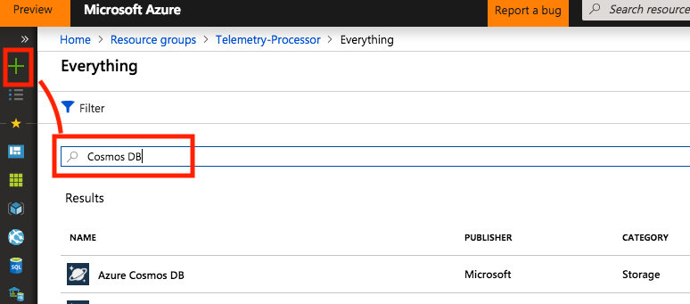
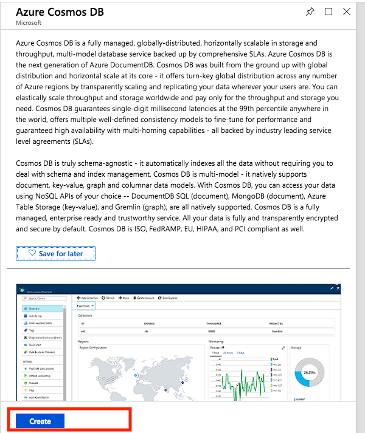
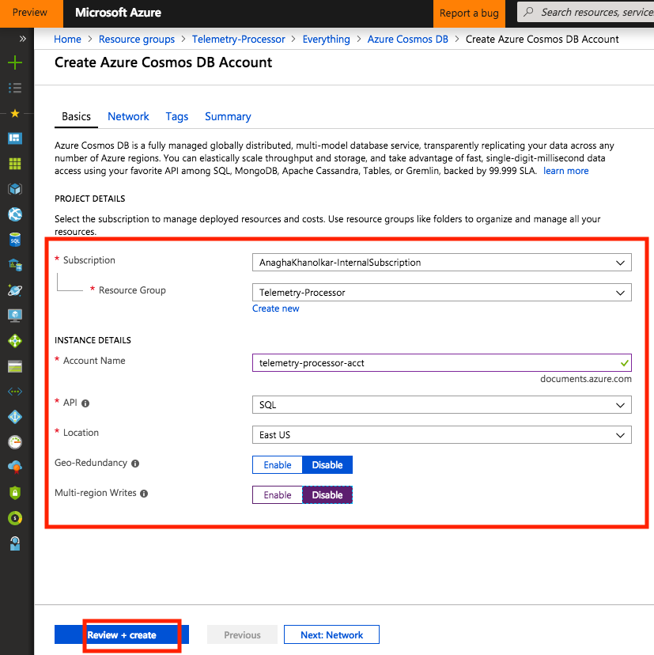
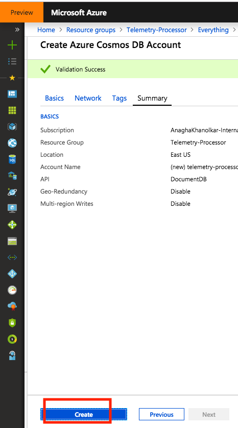
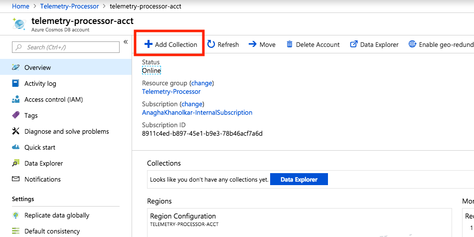
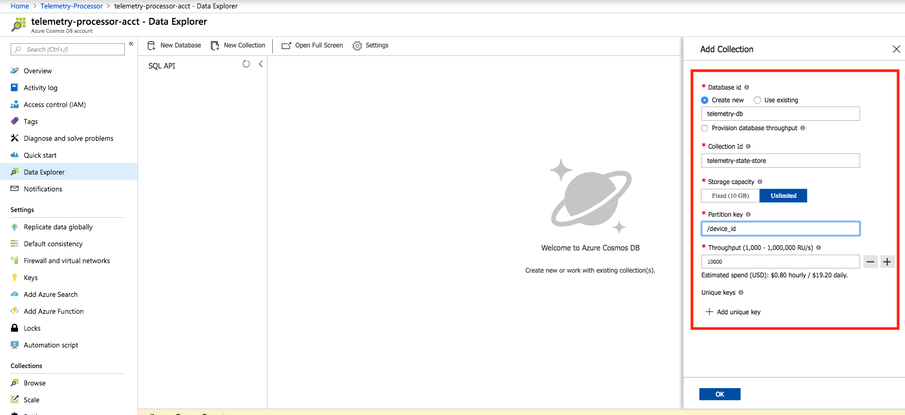
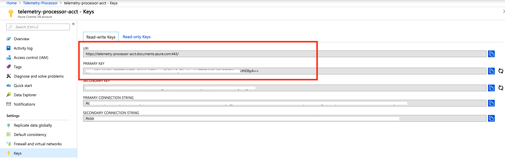

This section covers provisioning of Azure Cosmos DB.

# 4. Azure Cosmos DB
From the portal navigate to the resource group you created - "Telemetry-Processor".

## 4.0.1.  Provision an Azure Cosmos DB account 
Follow the instructions below to create a Cosmos DB account: 
 

   

   

   

   

## 4.0.2.  Create a Cosmos DB database, and collection
Follow the instuctions to create a database and collection: 

   

   

## 4.0.3.  Capture credentials for Spark integration
Capture the credentials circled in red: 

   
