This section covers provisioning of Azure Cosmos DB.

# 5. Azure Cosmos DB
From the portal navigate to the resource group you created - "Telemetry-Processor".

## 5.0.1.  Provision a storage account for Databricks 
### 5.0.1.1.  Create storage account
Create a general purpose storage account (version 1) in the resource group - Telemetry-Processor. 
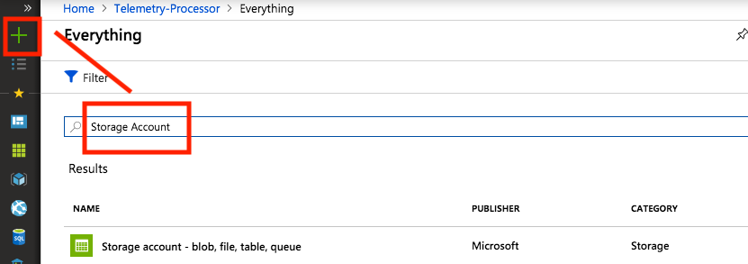
 
 
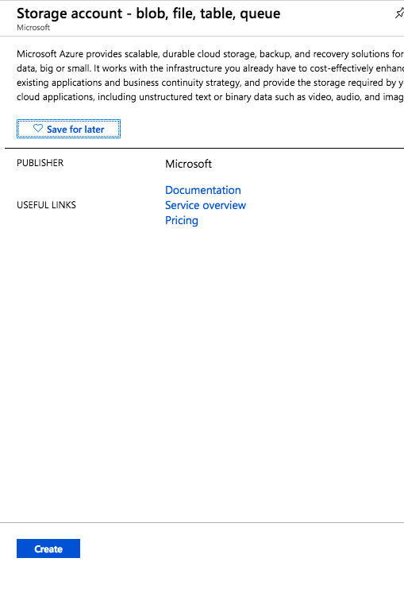
 
 
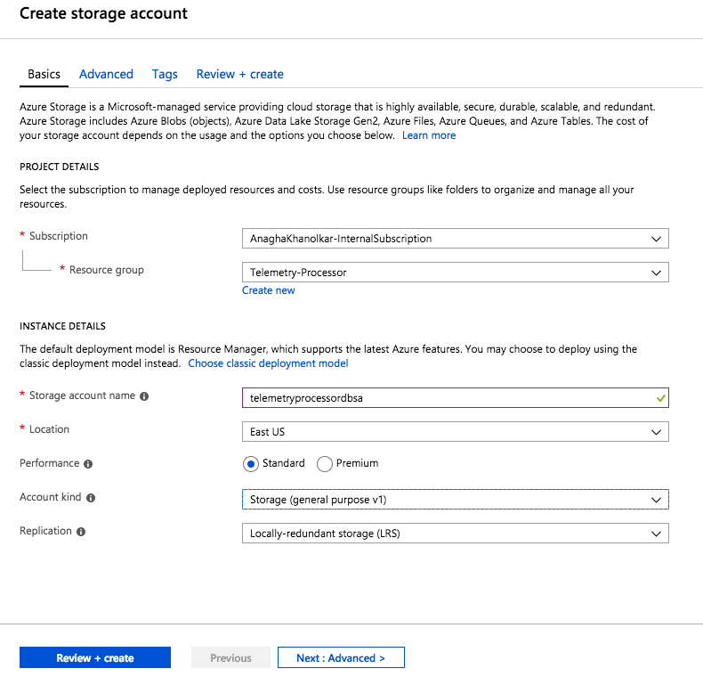
 
 
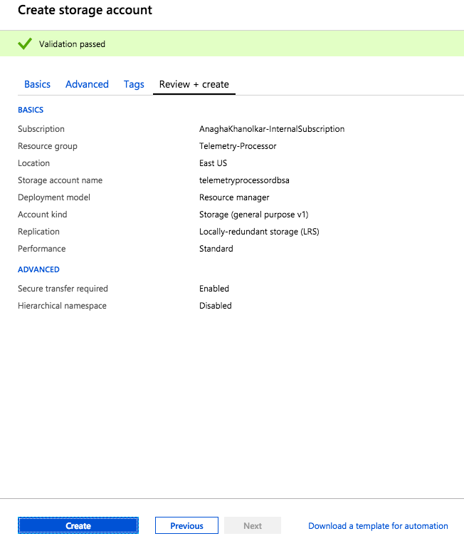
  

### 5.0.1.2.  Create storage account containers
Within this storage account, provision 3 containers with private (no anonymous access) configuration  
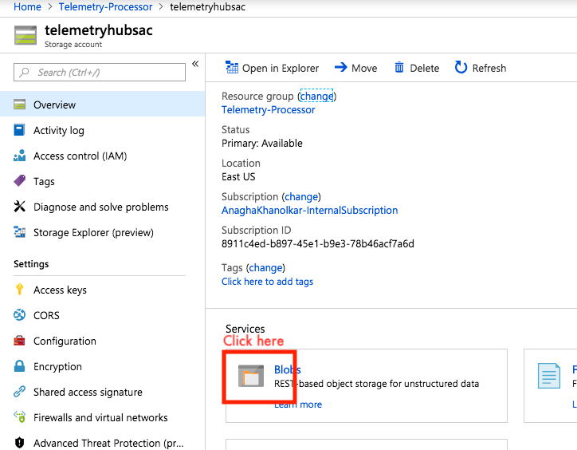
  1.  Create a container called raw 
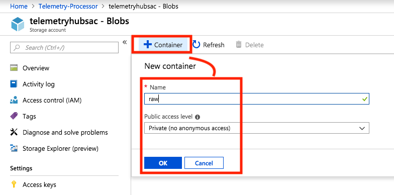
  2.  Create a container called curated 
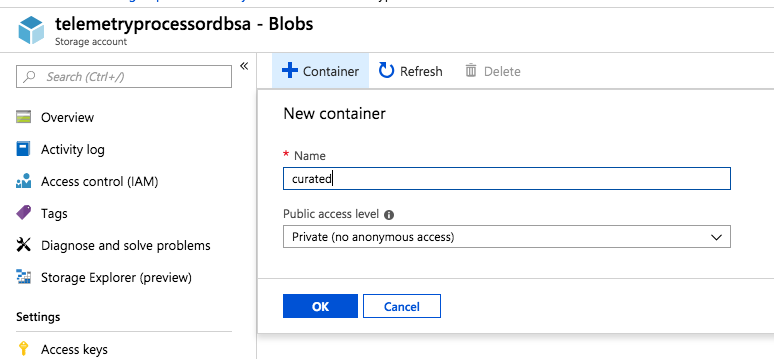
  3.  Create a container called consumption 
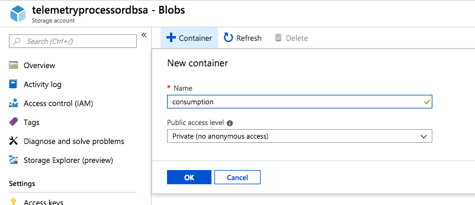
  
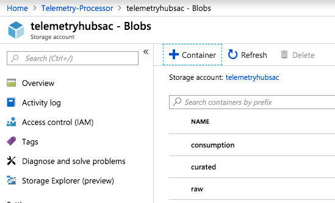

### 5.0.1.3. Capture the storage account credentials
Storage account credentials is needed for accessing the storage account from the Databricks cluster.
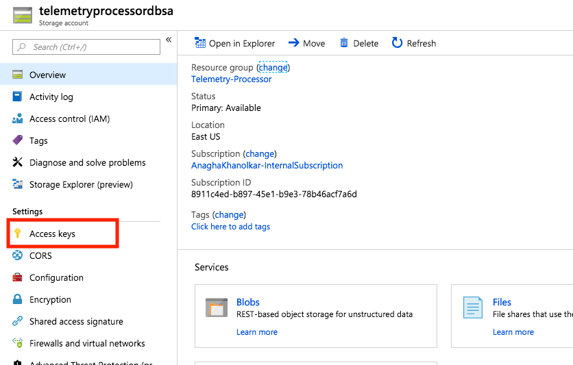
  
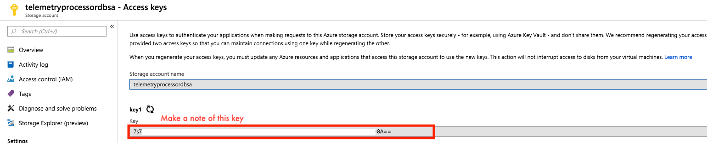
  

## 5.0.2. Provision an Azure Databricks workspace
Provision an Azure Databricks workspace in the resource group - Telemetry-Processor 
[Documentation](https://docs.microsoft.com/en-us/azure/azure-databricks/quickstart-create-databricks-workspace-portal)

   
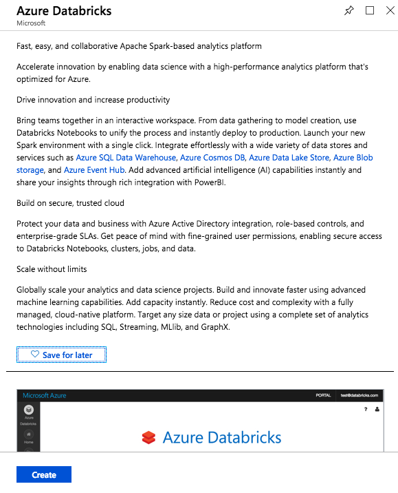
   
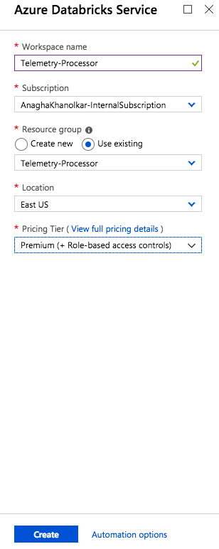
   

  

## 5.0.3. Provision an Azure Databricks cluster in the workspace
Provision an Azure Databricks cluster with 3 workers with default SKU, with ability to autoscale to 5 workers. 
[Documentation](https://docs.microsoft.com/en-us/azure/azure-databricks/quickstart-create-databricks-workspace-portal#create-a-spark-cluster-in-databricks)
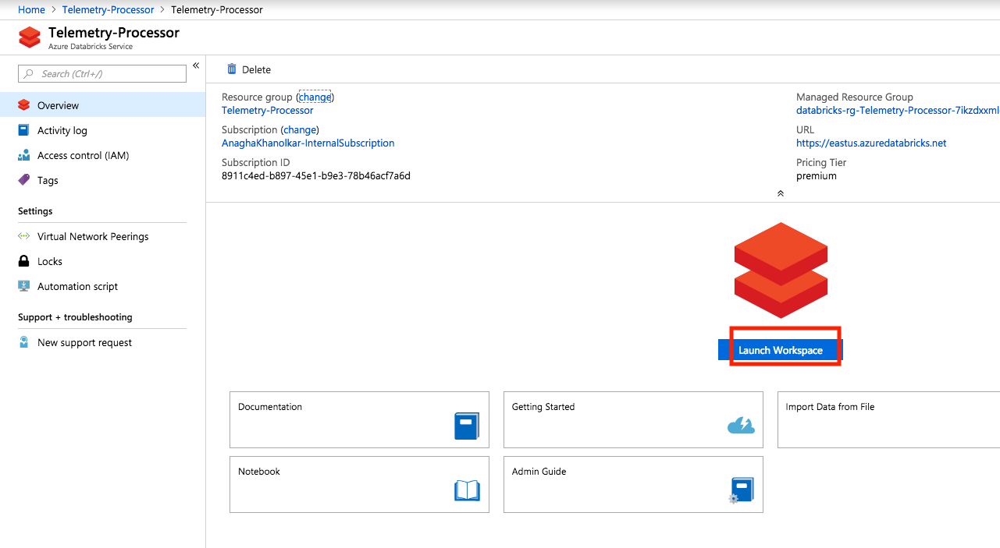
   
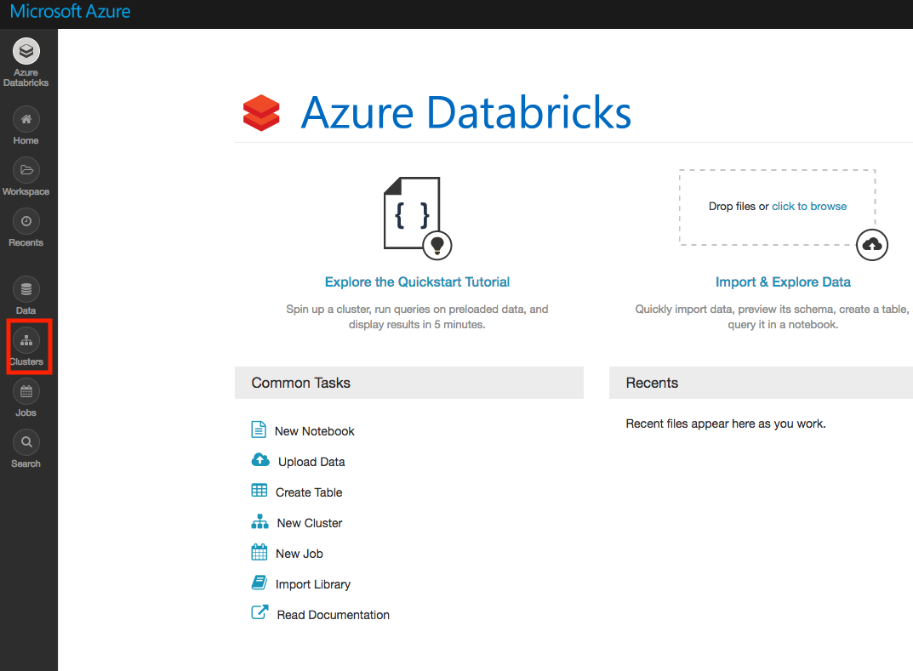
   
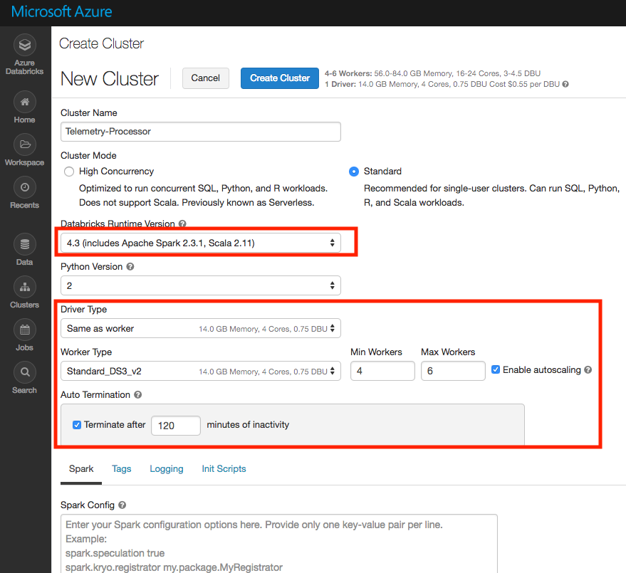
   

   
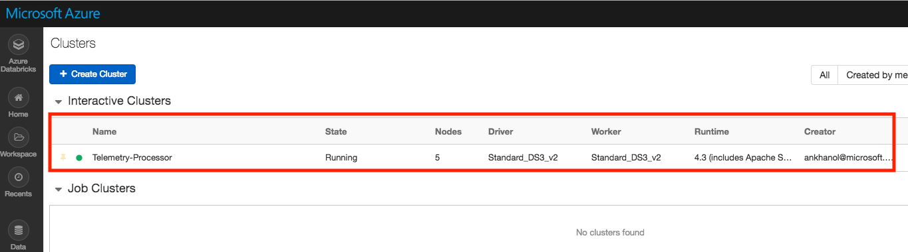
   

## 5.0.4. Set up Vnet peering between Databricks and virtual network in the resource group (for Kafka)
Set up peering from the Databricks vnet to the Kafka vnet and vice-versa. 
[Documentation on Vnet peering](https://docs.azuredatabricks.net/administration-guide/cloud-configurations/azure/vnet-peering.html#vnet-peering)

## 5.0.5. Add the Spark - Kafka dependencies to the cluster
Add the Spark Kafka library to the cluster 
Find the compatible version on Maven central.  For HDInsight 3.6, with Kafka 1.1/1.0/0.10.1, and Databricks Runtime 4.3, Spark 2.3.1, Scala 2.11, the author used- 
org.apache.spark:spark-sql-kafka-0-10_2.11:2.3.1

## 5.0.6. Add the Spark - Azure Cosmos DB dependencies to the cluster

## 5.0.7. Add the storage account credentials and Cosmos DB credentials to the cluster configuration
### 5.0.7.1. Add the storage account credentials

### 5.0.7.2. Add the Cosmos DB credentials

### 5.0.7.3. Restart the cluster

## 5.0.8. Add the Spark - Azure Cosmos DB dependencies to the cluster
