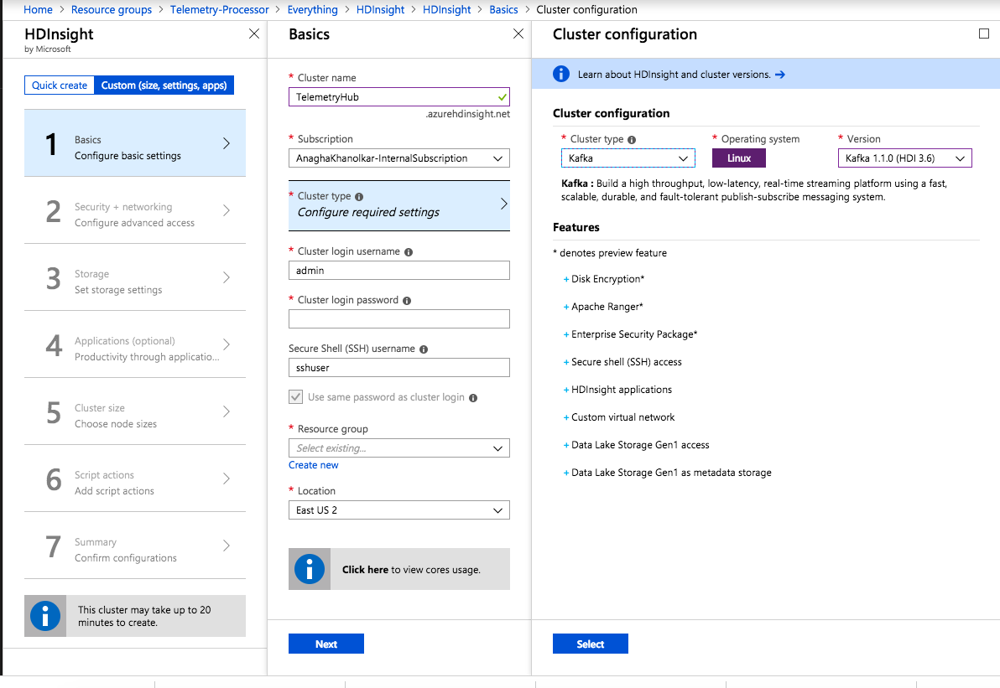
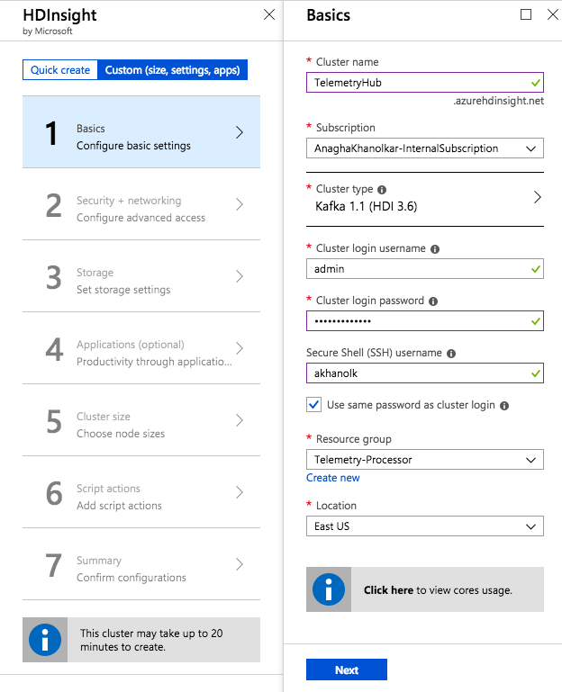
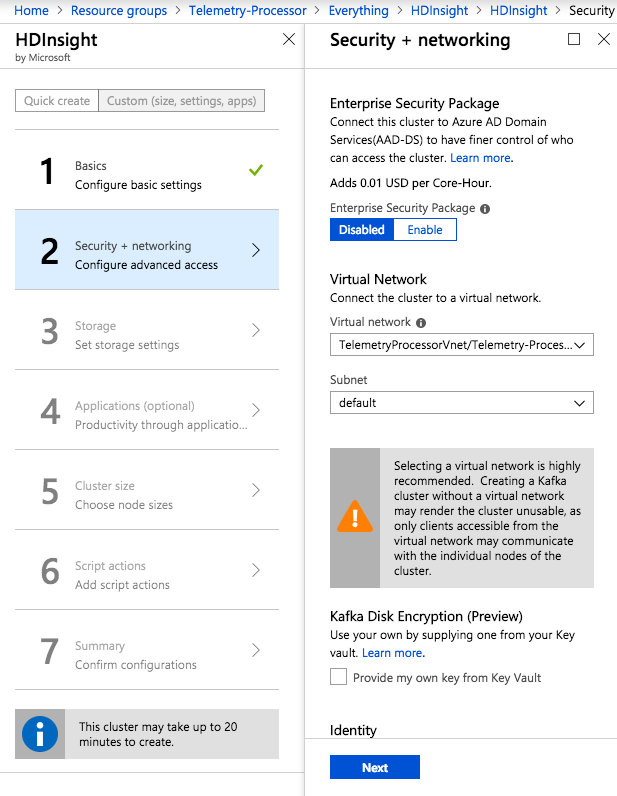
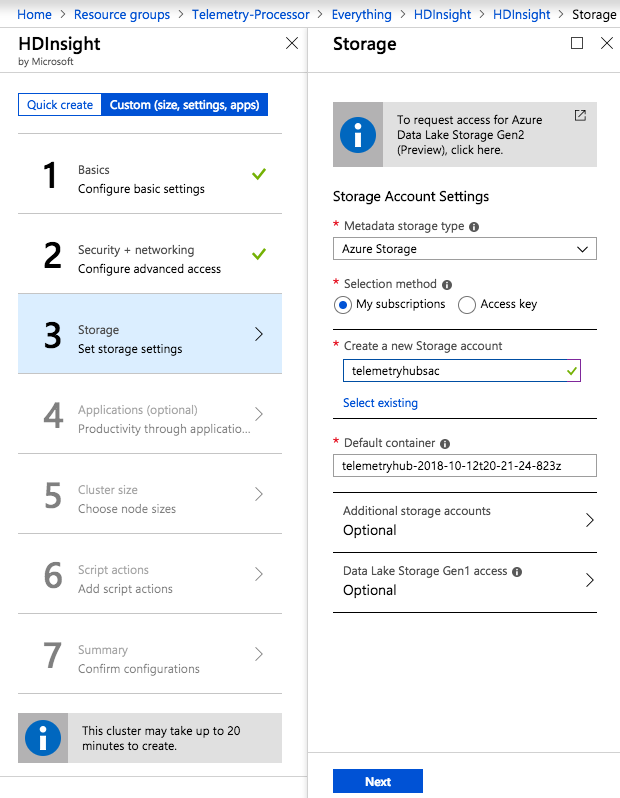
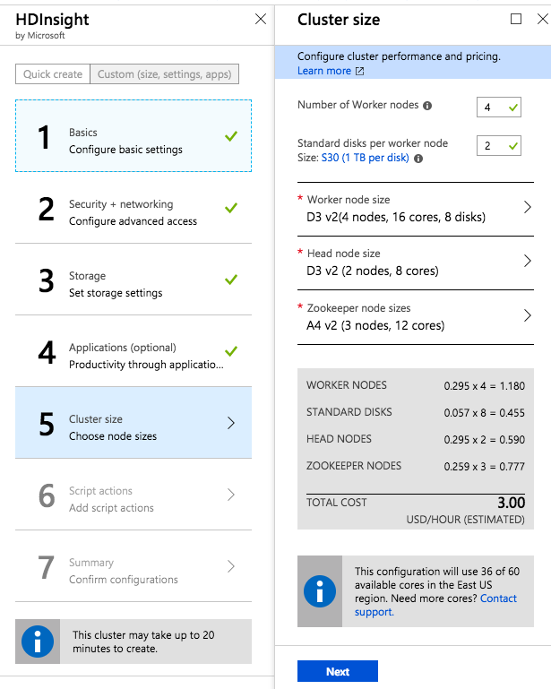
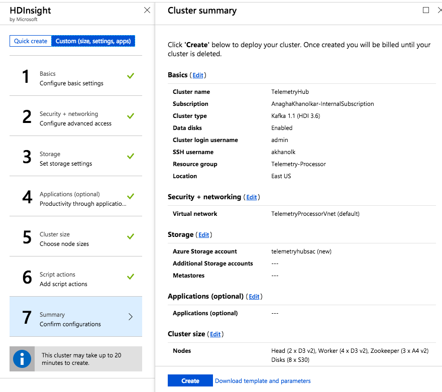
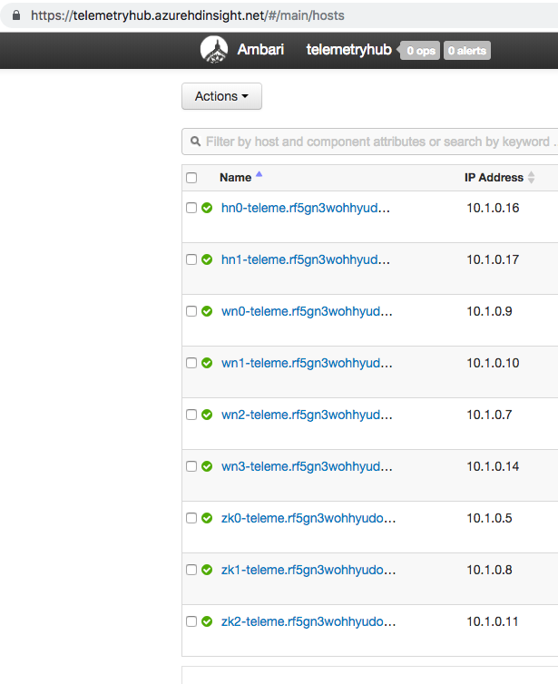

This section covers provisioning of Azure HDInsight Kafka and configuration required.

# 6. Azure HDInsight Kafka
From the portal navigate to the resource group you created - "Telemetry-Processor".

## 6.0.1.  Provision HDInsight Kafka 
Follow the instructions below to provision Kafka.<br>


<br><br><br>


<br><br><br>


<br><br><br>


<br><br><br>


<br><br><br>


<br><br><br>


<br><br><br>


<br><br><br>


## 6.0.2.  Configure Kafka for IP advertising
By default, Zookeeper returns the FQDN of the Kafka brokers to clients - not resolvable by entities outside the cluster.  Follow the steps below to configure IP advertising/to broadcast IP addresses - from Ambari.<br><br>


<br><br><br>

<br><br><br>

<br><br><br>

<br><br><br>
Paste this at the bottom of the kafka-env comfiguration<br>
```
# Configure Kafka to advertise IP addresses instead of FQDN
IP_ADDRESS=$(hostname -i)
echo advertised.listeners=$IP_ADDRESS
sed -i.bak -e '/advertised/{/advertised@/!d;}' /usr/hdp/current/kafka-broker/conf/server.properties
echo "advertised.listeners=PLAINTEXT://$IP_ADDRESS:9092" >> /usr/hdp/current/kafka-broker/conf/server.properties
```

<br><br><br>

## 6.0.3.  Configure Kafka to listen on all network interfaces
By default, Zookeeper returns the domain name of the Kafka brokers to clients - not resolvable by entities outside the cluster.  Follow the steps below to configure IP advertising.<br><br>

<br><br><br>

## 6.0.4.  Restart the Kafka service from Ambari

<br><br><br>

<br><br><br>

<br><br><br>


## 6.0.5.  Capture the IP addresses of the brokers
The brokers have names starting with wn*.  Capture their private IP addresses.<br>

<br><br><br>

In the author's case, the broker port list is:
10.1.0.7:9092,10.1.0.9:9092,10.1.0.10:9092,10.1.0.14:9092
