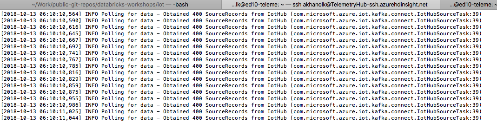
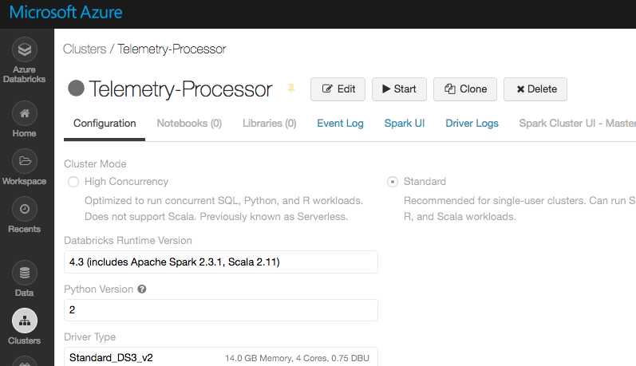
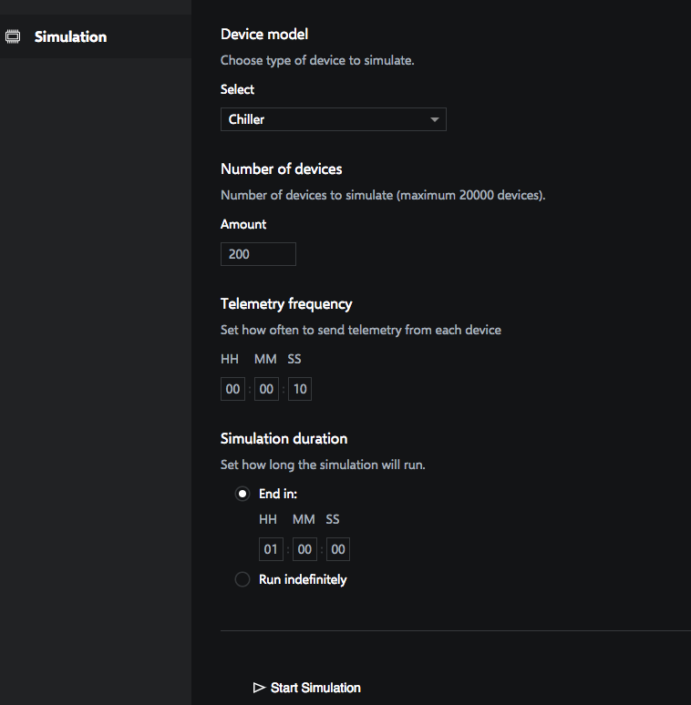
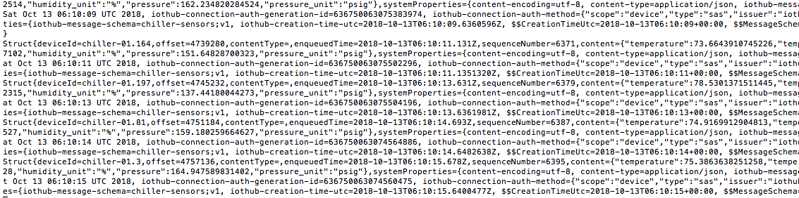

This section covers starting all the requisite components to start the data pipeline.

# 8. Start KafkaConnect

### 8.0.1. Start KafkaConnect service
On the HDInsight kafka edge node, on the Linux CLI, run the below.<br>
```/usr/hdp/current/kafka-broker/bin/connect-standalone.sh /usr/hdp/current/kafka-broker/config/connect-standalone.properties /usr/hdp/current/kafka-broker/config/connect-iothub-source.properties```
Do not shut down this terminal, unless you have launched the process with nohup as a background process.<br><br>
You should something like this...<br>



# 9. Start the Databricks cluster
From the portal, start the cluster.<br>



# 10. Start the IoT telemetry simulation

Go to https://www.azureiotsolutions.com/Accelerators, to your previously provisioned configured simulator, and start it.<br>


# 11. Validate event flow to Kafka via Kafka console consumer

On the Kafka edge node, launch the console consumer.
```
/usr/hdp/current/kafka-broker/bin/kafka-console-consumer.sh --bootstrap-server $KAFKABROKERS --topic "iot_telemetry_in" --from-beginning
```
If you see activity, you are good to proceed with the rest of the lab.  You can shut down the console consumer.

