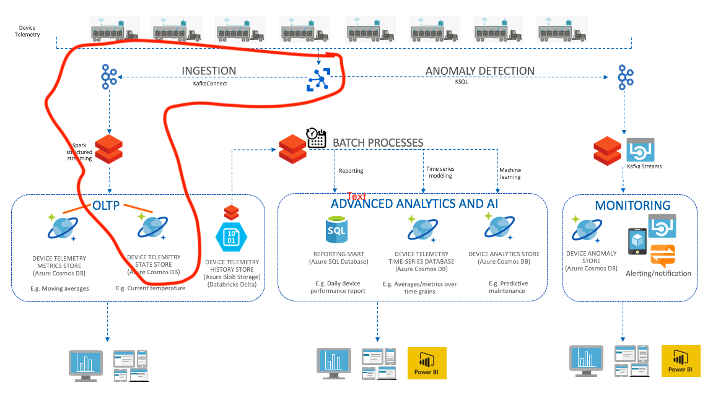
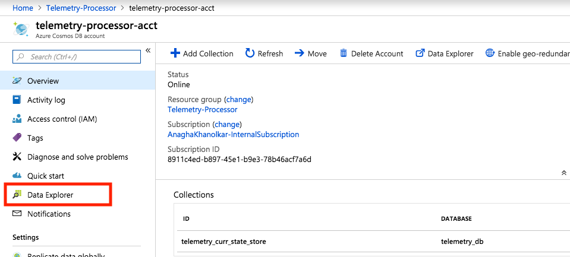
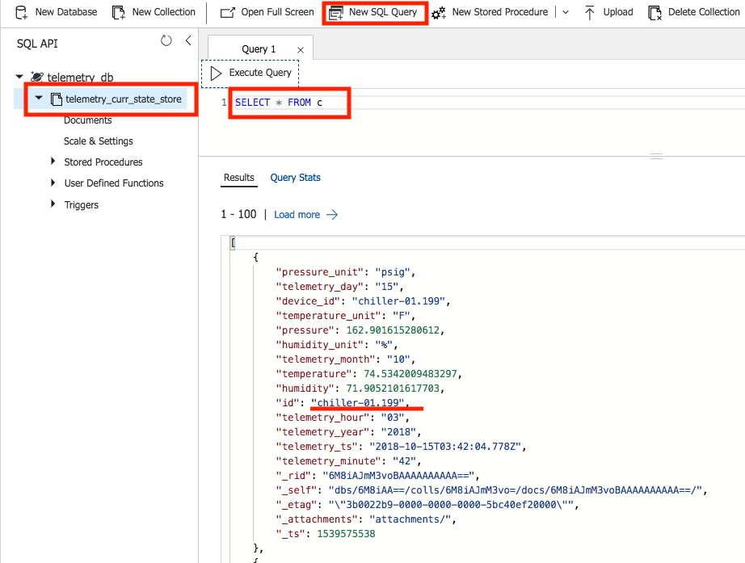
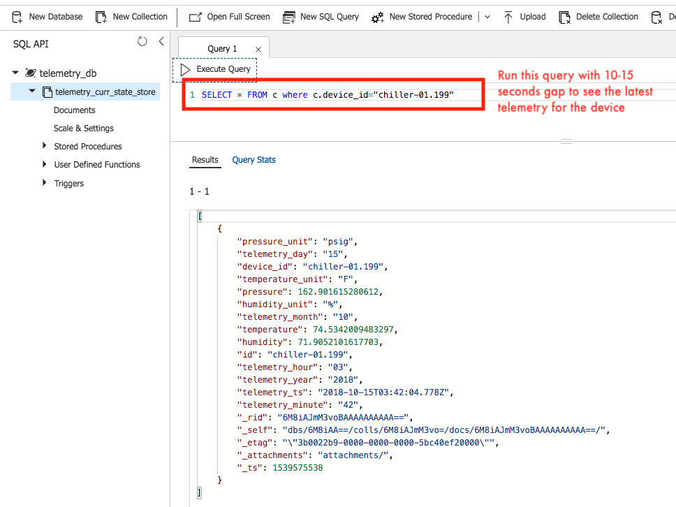
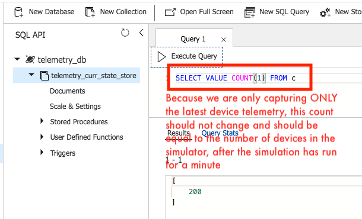
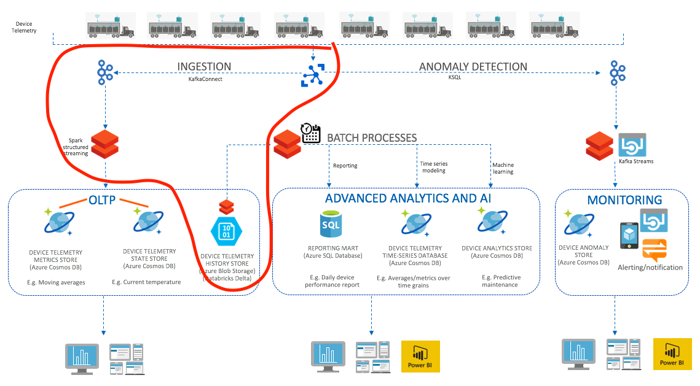

# Workshop
Execute each of the modules below sequentially.

## Module 1. Provision services, configure and start services
You will first need to provision all the required Azure resources upfront and complete all the specified configuration.  Follow the links below to complete provisioning, configuring and starting the services.
1.  [Device Telemetry Simulator & Azure IoT Hub](Provisioning-1-AzureIoT.md)
2.  [Azure resource group and virtual network](Provisioning-2-Common.md)
3.  [Azure Cosmos DB](Provisioning-3-AzureCosmosDB.md)
4.  [Azure Databricks](Provisioning-4-AzureDatabricks.md)
5.  [HDInsight Kafka](Provisioning-5-Kafka.md)
6.  [KafkaConnect Azure IoT Hub Source Connector](Provisioning-6-KafkaConnect.md)
7.  [Start the components](Provisioning-7-StartTheComponents.md)

## Module 2. Setup 
In this section you need to complete the setup section of the Databricks notebooks.<br>

#### 2.1.  Mount blob storage

We will mount blob storage as a Databricks file system, as a one-time activity so we can seamlessly access it as a file system , and without having to provide credentials each time we access it.

**Execute the notebook 00-Setup/1-MountBlobStorage.scala** in your Databricks cluster.<br>
Be sure to replace the name of the storage account at the beginning of the notebook with your storage account name.<br><br>

Typically, we organize data in big data solutions, into multiple directories based on purpose, retention policies, and need for security.<br>
- **MasterData** - master data; Fairly static, may or may not have history requirements; optimized for fast access <br>
- **ReferenceData** - reference data; Not as static as master data; May or may not have history requirements; optimized for fast access <br>
- **Staging** - landing zone for data to be processed, transient data with short retention<br>
- **Raw** - raw data from source, stored permanently, and in full fidelity exactly as received from source, may or may not be optimized for storage and query processing.  Typically not accessible for querying other than by the application ID processing the data in an automated fashion.<br>
- **Curated** - Curated data may be all or a subset of raw data, with a specific business purpose.  It is cleansed, deduplicated, transformed, merged, augmented (with reference and master data), stored, potentially indefinitely or with a specific retention policy and access policy.  Due diligence applied when it comes to physical storage partitioning scheme for query performance, persistence format for storage and query performance optimization - e.g. Parquet for analytical/all workloads, avro for row-level.  Compression for storage optimization. This layer may be exposed for exploratory aalytics to data product designers.<br>
- **Consumption** - Materialized views, reports optimized for querying and purpose-built for specific consumers.<br><br>

We will create only a part of these in the workshop.

## Module 3. Structured Stream Processing - Device current state capture into Azure Cosmos DB (nosql)


### 3.1. Spark - Databricks notebook
In this module, we will run the notebook, **01-StreamIngest/01a-Stream-SinkTo-CosmosDB.scala**, to execute the flow described in the diagram above.  We will read events streaming into Kafka from devices, routed through Azure IoT Hub, and persist to Azure Cosmos DB.  We will persist in upsert mode, only the latest telemetry - to capture, just the current state.  In a separate notebook, we will cover persisting all telemetry.<br><br>

In production, you would run this notebook, in a separate Databricks cluster, ensuring all services in the pipeline have adequate resources.<br><br>

### 3.2 Cosmos DB - Data explorer
While the pipeline is running, you can try some queries with the Azure Cosmos DB data explorer utility on the Azure portal.<br><br>
**Launching data explorer on Azure portal:**<br>
Navigate on the Azure portal to your Cosmos DB resource and launch the data explorer.<br>

<br><br>
**Queries:** <br><br>

**1. All telemetry**<br>
``` SELECT * FROM c ```

<br><br>
**2. Specific device - state change**<br>
Replace the below with the device you want to look up.<br>
```SELECT * FROM c where c.device_id="chiller-01.199"```

<br>
Run this multiple times over 10 second intervals to see the state change.
<br><br>
**3. Device count**<br>
Run this to get a count of the devices.  The result should be the exact same as the devices in the simulator.

<br><br>

## Module 4. Structured Stream Processing - Device telemetry history capture into Databricks Delta
In this module, in notebook **01-StreamIngest/01b-Stream-SinkTo-Delta-1.scala**, - <br>
1.  We will ingest from Kafka with Structred Streaming <br>
and<br>
2.  Sink to Databrick Delta<br><br>


<br><br>

In notebook **01-StreamIngest/01b-Stream-SinkTo-Delta-2.scala**, - <br>
We will create an external table against Databricks Delta, and run queries against it.<br><br>

Databricks Delta is fit for purpose common solution for batch and streaming workloads.<br><br>

**Do we really need Databricks Delta if we have a Nosql database in our IoT solution?**<br>
NoSQL databases like Azure Cosmos DB, HBase are fit for purpose of scalable OLTP - optimized for point look ups and small scans/range queries.  They can prove costly and not efficient/performant for analytics and reporting workloads requiring large sequential scans.  Therefore, always complement your nosql with a storage solution optimized for analytics - like HDFS, DBFS and such distributed storage systems.<br><br>

**Value proposition of Delta**<br>
- Delta automatically indexes, compacts and caches data helping achieve up to 100x improved performance over Apache Spark. <br>
- Delta delivers performance optimizations by automatically capturing statistics and applying various techniques to data for efficient querying.<br>
- Delta provide full ACID-compliant transactions and enforce schema on write, giving data teams controls to ensure data reliability. <br>
- Deltaʼs upsert capability provides a simple way to clean data and apply new business logic without reprocessing data.<br>
- Delta dramatically simplifies data pipelines by providing a common API to transactionally store large historical and streaming datasets in cloud blob stores and making these massive datasets available for high-performance analytics.<br>
- Databricks Delta, a key component of Databricks Runtime, enables data scientists to explore and visualize data and combine this data with various ML frameworks (Tensorflow, Keras, Scikit-Learn etc) seamlessly to build models. As a result, Delta can be used to run not only SQL queries but also for Machine Learning using Databricks Workspace on large amounts of streaming data.<br><br>


